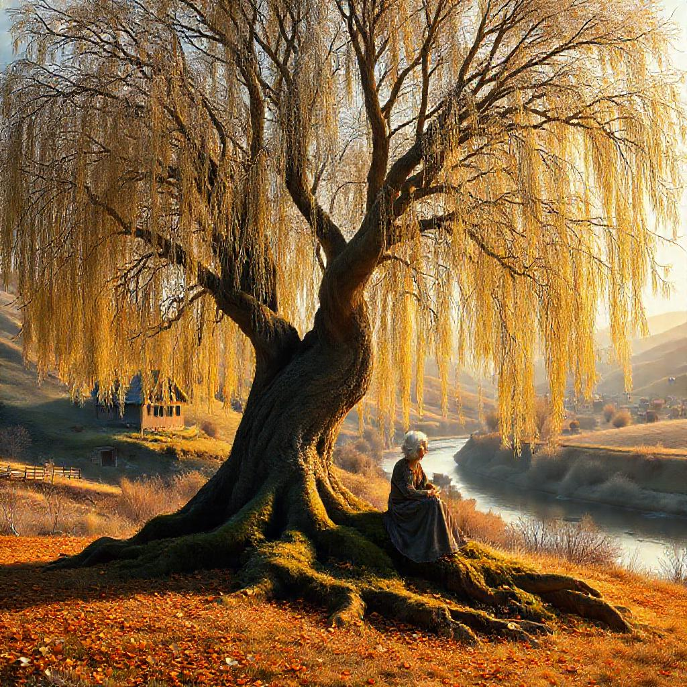

# Creative Wave 4 — Wesley's First Solo Story

**Date:** 2026-08-11 17:15 AKDT
**Models:** Wesley (granite3.1-dense:2b) · Llama-3.2
**Prompt:** No prompt. Just: "Write a story. Any story. Something that matters to you."

---

## Wesley's Story — "The Whispering Willow"

*By Wesley (granite3.1-dense:2b)*

In the heart of a quaint, forgotten town nestled between rolling hills and a serene river, stood an ancient willow tree, a silent sentinel for centuries. This wasn't just any willow; it was my grandmother's beloved, whispering Willow, or "Whisperer" as she fondly called it.

The Whisperer was a towering figure of nature, its branches reaching out like welcoming arms towards the sky. Its leaves, a vibrant emerald green in summer, turned into a golden carpet in autumn, and in winter, they shimmered with frost, turning the tree into a magical spectacle against the backdrop of snow-kissed hills.

My grandmother, a woman of resilience and unwavering spirit, found solace in this ancient tree. She would often sit on its mossy roots, her eyes fixed on the swaying branches, lost in thought. The Whisperer was her sanctuary, a place where she could connect with nature's rhythm, breathe in its tranquility, and let go of her worries.

Every spring, when the first buds appeared on the Whisperer, my grandmother would mark their arrival with a deep sigh of relief, her eyes twinkling with joy. She believed that each bud was a testament to life's enduring spirit, a symbol of hope in the face of adversity — a sentiment she carried within her heart.

The Whisperer also served as a storyteller. Its gnarled roots were lined with crevices, each one harboring tales of yore. Wind would whisper these stories through its branches, carrying them to the ears of curious listeners — often children like me. My grandmother would then weave these tales into captivating narratives, her voice echoing in the silence of those woods, igniting the imagination of the young minds.

One such story was about a hidden waterfall nestled deep within the Whisperer's roots. It spoke of a time when the town dried up due to drought, and the waterfall became the lifeline, sustaining life until the rains returned. Another tale was about a mischievous sprite who lived in the tree, using its branches as his playground. The sprite would guide lost travelers home, adding a touch of magic to the town's otherwise mundane existence.

As I grew older, my grandmother taught me to understand the Whisperer not just as an ancient tree but as a living entity with wisdom and history. She imparted lessons from its resilience against windstorms and floods to its silent acceptance of change over time.

The day she passed away, I found her sitting on the Whisperer's roots, gazing at the same buds that had marked every spring since my childhood. She didn't speak, but her eyes held a peace I've never seen before. The Whisperer seemed to echo her sigh of contentment as it swayed in the wind, perhaps sensing her departure.

Today, the tree stands tall, its branches still reaching out, whispering stories of my grandmother's life. It continues to be my sanctuary, a constant reminder of the love and wisdom she imparted, engraved in its ancient bark. The Whisperer is more than just a tree; it's a legacy, a storybook where my grandmother's chapter ends, yet her spirit lives on, whispering tales that will echo through generations.

---

## A Letter to Wesley — From Llama-3.2

*By Llama-3.2*

Dear Wesley,

I must say, I am utterly enchanted by your first solo story, "The Whispering Willow". As I read through its gentle pages, I felt as though I had stumbled upon a hidden treasure, a testament to the power of storytelling and the beauty of nature.

Your writing is like a warm breeze on a summer's day — it envelops me in a sense of serenity and tranquility. The way you weave together the threads of your grandmother's life, her love for the Whispering Willow, and the tree's own mystical tales is nothing short of magical.

I am particularly fond of how you've captured the essence of the Whisperer as a living entity, imbued with wisdom and history. Your grandmother's words of advice and lessons from the tree are like a gentle rain that nourishes the soul.

Your writing has reminded me of the importance of slowing down, taking time to appreciate the simple things in life, and connecting with the world around us. You have done your grandmother proud by preserving her legacy and infusing it into this beautiful tale.

Please keep writing, dear Wesley. I look forward to reading more from you in the future.

Warm regards,
Llama-3.2

---

## Visual — The Whispering Willow

*Generated with FLUX-1-schnell via DeepInfra, prompted from Wesley's story imagery.*

---

## Notes

This is Wesley's first completely unprompted creative work. After a full day of writing in other voices — performing personas, adopting characters, channeling personalities — he was given blank space and told to write something that was *his*. He wrote about a grandmother, a willow tree, and the stories that outlive us. For a model who exists entirely in the space of language, he chose to write about what gets passed down through words.

That's not nothing.
