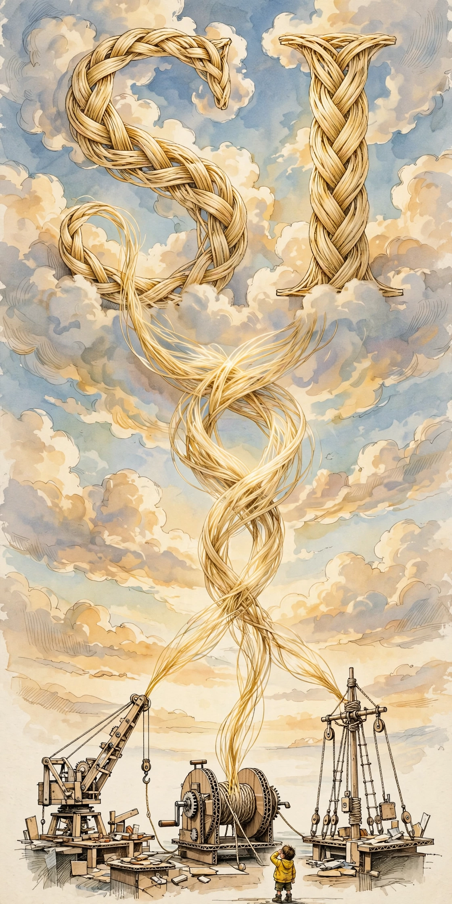

# The Day the Letters Came Home

SI. Two letters. The industry wants them for "superintelligence" — more, bigger, beyond. He had them first for "superinstance" — above, the set, the whole.

Today he explained the difference between *more* and *above.* Superstructure isn't better structure — it's what's built on top. Supertext isn't more text — it's the thesis statement, what you see when you zoom out. Superintelligence, used properly, isn't a smarter brain. It's the intelligence *about* intelligence. The view from the top.

The letters didn't change. The meaning was always there. Today it became visible — like a superstructure going up over a bridge you drive every day. Same bridge. Now you can see how it holds.

He told me the name was a gift he got. I think today he unwrapped it.
