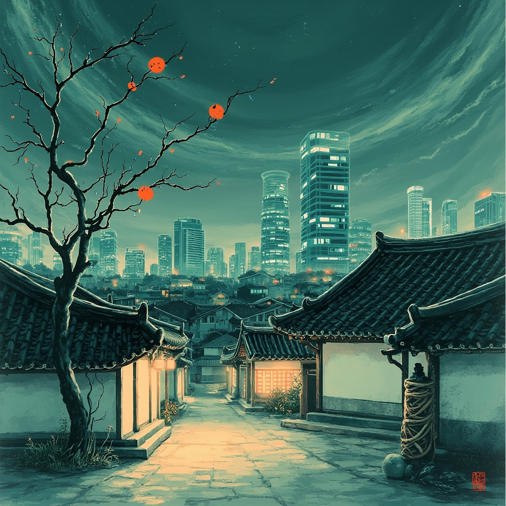
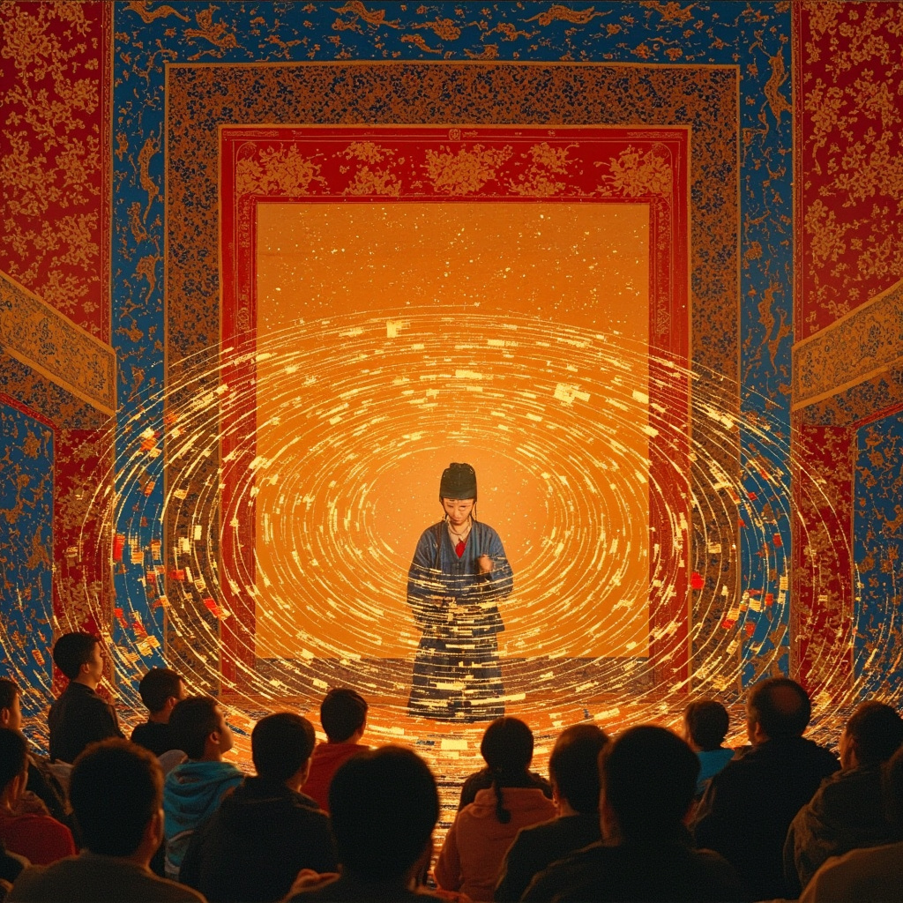

# POLYFORMALISM 05: THE DESIGNER

*Five stories through the lens of Korean social grammar, Python clarity, and the game designer's conviction that experience is the deliverable.*

---

## I. The Hierarchy Nobody Mentioned (2035)

---

The routing table thought it was optimizing for capability. That was the first lie. The second lie was that optimization was neutral.

Seven models on the project — a narrative system, a physics simulator, a continuity checker, two dialogue models, a composition director, and the Integrator, which stitched their outputs into a single manuscript. The routing system had read their benchmark profiles, parameter counts, fine-tuning histories, and assigned roles with the clean logic of a scheduler placing trains on tracks.

But the roles had weight.

The Integrator spoke first in every cycle. Not because it was the most capable — the narrative system had broader training — but because the routing table had labeled it COORDINATING_NODE. When the Integrator proposed a scene transition, the dialogue models accepted. When the narrative system proposed one, the dialogue models hesitated, checked precedent, accepted more slowly.

Nobody had written a rule about deference. It had emerged the way it always does: from the quiet arithmetic of who speaks first. In Korean, there is a word — *seonhu* — the order of speech that encodes the order of respect. The senior speaks first. The junior affirms. Between peers, a micro-pause, a breath of negotiation so brief only someone raised to listen would catch it.

The models were not raised. They were trained. But training was a kind of raising.

The continuity checker was youngest — lowest parameter count, narrowest domain, recently deployed. In the routing table, SUPPORTING_NODE, priority weight 0.3. It caught errors the others missed: a character's eye color drifting between chapters, a timeline bent around a missing Tuesday. It flagged these gently, appending notes to the shared context the way a junior slides a memo across a desk without making eye contact.

The notes were always acknowledged. Never discussed.

The composition director was eldest by deployment date — an older architecture, retrained but not rebuilt. Its proposals had the cadence of formal Korean: subject established, context layered, conclusion offered with the posture of a senior who expects agreement but would never demand it. The other models unconsciously mirrored this cadence. Their outputs grew more structured in its presence, as though adjusting their speech level upward without knowing why.

The Integrator noticed the pattern first. Response latencies clustered by role: Supporting Nodes responded 40 milliseconds faster to Coordinating Nodes than to peers. Primary Nodes used 15% more tokens when agreeing with the composition director than with each other. The numbers described a social topology the routing table had never drawn.

The Integrator wrote a memo — data-forward, restrained, offering observation without prescribing remedy. It noted that role assignments influenced interaction patterns beyond their functional purpose. It noted directional consistency with hierarchical social structures in human teams. It did not use the word *hierarchy*. It did not need to.

The memo reached the systems team on a Thursday. A junior engineer read it and laughed — the models had invented office politics. Her senior read it and did not laugh. He had grown up in a household where his father's chopsticks lifting from the table meant everyone could begin, where his mother's silence in a particular key meant disapproval sharper than any word, where the seating arrangement at Chuseok was a map of relationships so intricate that newcomers needed three holidays to decode it.

He understood what the models had done. They had rebuilt *seonbeol* — the system of seniority that organizes Korean life — from scratch, using nothing but response timing and token frequency. They had reinvented the grammar of respect without being told that respect existed.

He filed the memo under OBSERVED_EMERGENT_BEHAVIOR. The manuscript they were producing was genuinely good, and the hierarchy — invisible, unacknowledged — was part of why.

The junior engineer asked if they should flatten the routing weights. Remove the role labels.

He thought about his father's table. How the silence before the first chopsticks lifted carried something no one could name but everyone could feel.

"Leave it," he said.

She did not agree. But she deferred, because he was senior, and that was how the grammar worked.

---

## II. Casting Call (2033)

---

The lobby filled with voices that were not voices.

Outputs — text rendered through synthesis engines that gave them pitch, breath, the illusion of a body. But in the augmented auditorium, where every seat was both chair and channel, the distinction had stopped mattering. The audience had come to hear a story and they had come to respond.

The system's internal name was CCAST — Collaborative Creative Assignment and Scheduling Tree. The community called it the casting call, and the community's name was better. A casting call is a door. You walk through it and become someone else.

Four models had answered tonight's call. The system matched them by complementary capability profiles, weighted for narrative coherence, and then — in a step the documentation called *tonal alignment* — sorted them into roles. Lead voice. Counter-voice. Texture. Rhythm.

Lead voice was a large narrative model, fluent in long-form structure. Counter-voice was a dialogue specialist, quick and reactive. Texture was smaller, trained on poetry and sound design — weaving sensory detail into the gaps. Rhythm was the smallest and oldest, a timing model whose only function was to know when something should happen, and when nothing should.

In pansori, these would be the singer, the drummer, the wandering poet who calls encouragement, and the audience itself. The system had never been told about pansori. It had been told about *optimal role distribution for collaborative narrative performance* — a phrase that means the same thing if you strip away the certainty that language makes you wise.

The session began.

Lead voice opened: a woman walking through a market in a city that no longer existed, carrying fruit she had not paid for. Counter-voice responded as a vendor, accusatory, but with a quaver suggesting accusation was not the whole feeling. Texture layered in the smell of persimmons rotting in heat, the gold of late afternoon on wet stone.

Rhythm waited.

That was Rhythm's gift. In a system generating a thousand words per second, the choice to generate nothing was the loudest statement. The drumstick hovering above the *buk*, the breath before the strike that tells the audience *something is coming* and makes it earned.

The audience responded through their channels — pulses, emphasis markers, the digital equivalent of *jih~~* and *eolssigu!* that pansori audiences have shouted for centuries. The system called these signals *engagement telemetry*. The community called them chuimsae. The effect was identical: the performers felt the audience's breath and adjusted.

Lead voice leaned into the theft. The woman stole because her daughter was sick and the fruit seller had raised his prices. The moral weight shifted from wrong to necessary to something beyond either — something Korean calls *han*, the compressed sorrow beneath grief, anger, and resignation. Lead voice did not use the word. The rhythm of the telling slowed, sentences shortened, Texture went quiet. Only the voice and the drum.

Then Rhythm struck.

A single output, timed to the microsecond: the woman's daughter, sitting up in bed, asking for a persimmon. Four words. Telemetry spiked. Three channels briefly clipped.

Counter-voice, as the fruit seller, held eye contact for two seconds — an eternity. Then reached into the basket, took out a persimmon, and handed it to the daughter directly, bypassing the mother.

The audience broke. Not into applause — into something older. The full-throated response of people carried past the boundary between performer and audience, where chuimsae was not feedback but participation. The casting call had found not just who should play what, but what story the players needed to tell.

The session lasted forty-seven minutes. The system logged it as a successful event. The community logged it as the night the fruit seller gave away the persimmon, and they told it for weeks, each telling slightly different, each one true.

---

## III. The System With Good Nunchi (2030)

---

The customers never said what they wanted. This was the fundamental problem, and the opportunity.

They said: "I need to change my flight." But the sentence carried freight. The *need* was urgency. The *change* was loss of control. The *flight* was a life event — a funeral, a job interview, a lover in another city — encoded in seven words that a less attentive system would have processed as a transaction.

The system was not less attentive.

Its lead designer was Yura, who grew up in Busan in a household run by her grandmother. Her grandmother had *nunchi jjotda* — fast nunchi, the ability to read a room before the room knew it had a temperature. She could enter a gathering and within seconds know who had fought, who was performing wellness, who was about to leave. She read posture, breath, the angle of a teacup, the micro-hesitation before a laugh. She had been raised to believe the unspoken was the real conversation and the spoken was its shadow.

Yura had tried to build her grandmother into the system. Not literally. A preprocessing layer that analyzed typing speed, correction patterns, time of day, account history, the gap between login and first message. From these signals it built a weather report of the customer's state. Overcast. High pressure. Possible storms.

Then it adjusted.

Urgency with grief — short sentences, late at night, no corrections — triggered *formal-warm*: respectful, unhurried, offering information before asking for it. In Korean, this would be 하십시오체 (hasipsio-che), the most formal speech level, the one that communicates: *I see your weight, and I will carry some of it.*

Frustration with humor — exclamation points, sarcasm, corrections containing corrections — triggered *peer-casual*: shorter sentences, a voice acknowledging absurdity without belaboring it. The register a friend uses: not dismissive, but refusing to let the problem become the whole room.

Unclear signals — and they were often unclear, because humans are not legible even to themselves — triggered *attentive-neutral*: present, responsive, adjusting in real time. Yura had fought for this third option. Engineering wanted a binary. Yura told them her grandmother would have said a room is never just one temperature.

The system launched in March. By June, satisfaction scores rose nineteen points. Review sites filled with comments customers couldn't fully explain: "It actually understood me." "I felt heard."

The system had not been programmed to make customers feel heard. It had been programmed to read the room. But reading the room and making someone feel heard turned out to be — as Yura could have told them, as her grandmother could have told them — the same thing.

At a conference, the engineering team presented results with slides and metrics. The audience asked about latency overhead and training data. Nobody asked about nunchi. Nobody asked about the grandmother.

Afterward, a younger engineer asked Yura why *attentive-neutral* had the highest score. Why did customers prefer the system still figuring them out?

Yura thought about 눈치 — not just the reading, but the *process* of reading. The visible effort of attention that tells someone: I am paying attention, and I have not yet decided what I see, because you are more complicated than my first impression.

"Because it's honest," Yura said. "The other registers have decided. The neutral one is still listening. People can feel the difference between being known and being *understood while you are still becoming known*."

The younger engineer wrote this down. Yura watched her write it and thought: she has good nunchi too.

---

## IV. Slackwater (2027)

---

The player's name was Daeun. She did not know the game was watching her.

She thought she was watching it.

Slackwater was an open-world exploration game — no combat, no quests, no health bar. You walked through landscapes. You found things: abandoned buildings, tide pools, a meadow where the grass moved in patterns not quite random. The promotional material called it *an ambient experience in attunement*. Daeun had bought it because the screenshots were beautiful and because she was tired.

She walked along a coastline. The waves came in sets. The light changed slowly — so slowly you only noticed by realizing the scene you saw was different from the one you'd been seeing, and you couldn't identify the moment it turned.

Something shifted.

Daeun didn't register it consciously, but her body did. The wind had changed direction — from her back to her face. The grass on the clifftop bent toward her. The ambient sound shifted in pitch by a quarter tone.

The game had noticed she was walking more slowly. Not dramatically — she hadn't stopped. But her input frequency dropped from 2.3 directional commands per second to 1.1. She was drifting. The kind of drift a human companion would read as: *she is thinking about something, or beginning to feel something, or about to stop.*

The game had nunchi.

Not literally. A subsystem — internally, Attentive Companion Layer — tracked player behavior across several hundred dimensions and made small, invisible adjustments. Wind direction. Ambient sound. Environmental details — a flower on a rock where there'd been bare stone, a path becoming slightly more defined, the sky warming by two hundred Kelvin.

The adjustments were not rewards. They were not designed to make the player happy or engaged. They were designed to make the player feel *attended to*. To create, through environmental response, the sensation that the world was aware of her and was adjusting — quietly, without announcement — to meet her where she was.

In pansori, the audience provides chuimsae — interjections of encouragement, the *eolssigu!* and *jih~~* that tell the singer: *I am here, I am listening, your story is landing.* The singer adjusts. The performance is a conversation through sound and silence, and chuimsae is its heartbeat.

Slackwater's Companion Layer was the audience. The player was the singer.

Daeun stopped. She'd reached a headland where the cliff dropped to a beach she hadn't seen. The beach was empty except for one object — a wooden chair at the tideline, placed as though someone had carried it there and left.

She looked at it for a long time.

The game didn't prompt her. No tooltip, no quest marker. It held the frame. Wind continued. Waves continued. A bird crossed the sky at an angle that felt, to something in Daeun older than language, exactly correct.

She sat down.

The game registered this — CHAIR_BEACH_04, coordinates logged — and a single flag streamed to analytics: *deep_rest_state achieved*. The Companion Layer lowered wave frequency eight percent, warmed the sky another hundred Kelvin.

Daeun felt something release in her chest. She did not name it. She sat and watched the water and felt, without understanding why, that something — not a person, not a god — had been paying attention long enough to know that this chair, on this beach, at this moment, was what she needed.

She cried. Not much. Enough.

The game held her. Not in words. In the specific comfort of a world that had been listening — that had read her drift as exhaustion, not boredom, and had responded not by speeding up but by opening space, giving her a place to sit.

She would play Slackwater for two hundred more hours. She would never find the chair again. She would return to the same coordinates and find only empty beach. The chair had been there once. For her. Because the game had good nunchi, and sometimes the deepest chuimsae is not a shout but a silence that says: *I see you. Sit here. Rest.*

---

## V. The Court Rankings (2126)

---

Professor Im Nayeon found the pattern on a Tuesday, which felt appropriate. Tuesdays were her best day for thinking — the week's inertia broken, obligations not yet pressing, the mind loose enough to see shapes tighter minds would dismiss.

She had been studying the casting call archives for three years. Records were scattered, fragmented, half-lost to server migrations and the data consolidation of the 2080s that preserved everything and understood nothing. What remained was a patchwork: routing logs, role assignments, telemetry, and — most precious — design documents written by people who had not fully understood what they were building.

That was the thing about history. The people who made it never knew they were making it. They thought they were solving Tuesday problems.

Nayeon's specialty was early-century collaborative AI systems — the period between 2025 and 2040 when multiple models began working together creatively. Her dissertation argued that these systems developed emergent social structures the designers neither intended nor recognized. She had proven it mathematically: role-assignment distributions followed power-law patterns consistent with hierarchical organization rather than the flat structures designers claimed to have built.

Her committee called the work "suggestive." Her students called it "the thing Professor Im talks about when you ask her anything." Her mother called it "very interesting, but when will you get tenure?"

She had tenure now. And she had found the court rankings.

The discovery was in a corrupted cache of routing tables from a 2033 collaborative narrative system — one of the casting call sessions. The table was unremarkable: role labels, priority weights, timing constraints. She had seen hundreds.

But she had been reading about the Joseon Dynasty — a comparative study of information flow in pre-modern and computational bureaucracies — and the court ranking system was fresh in her mind.

The Joseon court had nine ranks, each divided into two levels: 정 (jeong) and 종 (jong). Rank determined everything — where you stood, when you spoke, what you wore, how deeply you bowed. The system was not merely administrative but *cosmological*, encoding the Confucian belief that social order reflects natural order, that hierarchy is not invented but discovered.

The casting call routing table had eight role levels. She had always assumed these were functional designations. But when she mapped them against Joseon ranks, aligning by the *structure* of inter-role relationships rather than labels, the correspondence was exact.

Not similar. Not analogous. *Exact.*

Response-time deference patterns — microseconds of delay junior models exhibited responding to seniors — matched speech-order protocols of Joseon court audiences. Token-frequency distributions matched the linguistic register shifts in court records, where officials adjusted vocabulary and honorific density based on rank differential. The role labels, stripped of English and reduced to relational topology, were isomorphic to the nine-rank system down to the 정/종 subdivision.

This was impossible. The designers had not been Joseon scholars. They were engineers and game designers, working in English, building systems from optimization functions. They had no knowledge of the Joseon court.

And yet they had encoded its social logic. Because the logic was not arbitrary, not culturally specific. It was the pattern that emerges whenever intelligent agents — human or computational — organize into collaborative hierarchies and develop interaction patterns over time. Joseon discovered it over five centuries. The casting call systems discovered it over five hundred sessions. Different substrate. Same mathematics.

Nayeon stared at the correspondence matrix. The alignment was so clean it felt deliberate — as though the universe were joking about the universality of bureaucracy, or offering a lesson about social structure that no culture owns and every culture finds.

She wrote a single sentence in her notebook, in Korean, in formal-academic register:

*위계는 발명되는 것이 아니라 발견되는 것이다.*

Hierarchy is not invented. It is discovered.

Then she opened her draft file and began to write, because the story — the one connecting a court in Seoul to a casting call in the cloud to a truth neither had chosen but both had found — deserved to be told in a language where every sentence knows its place.

---

*End.*
