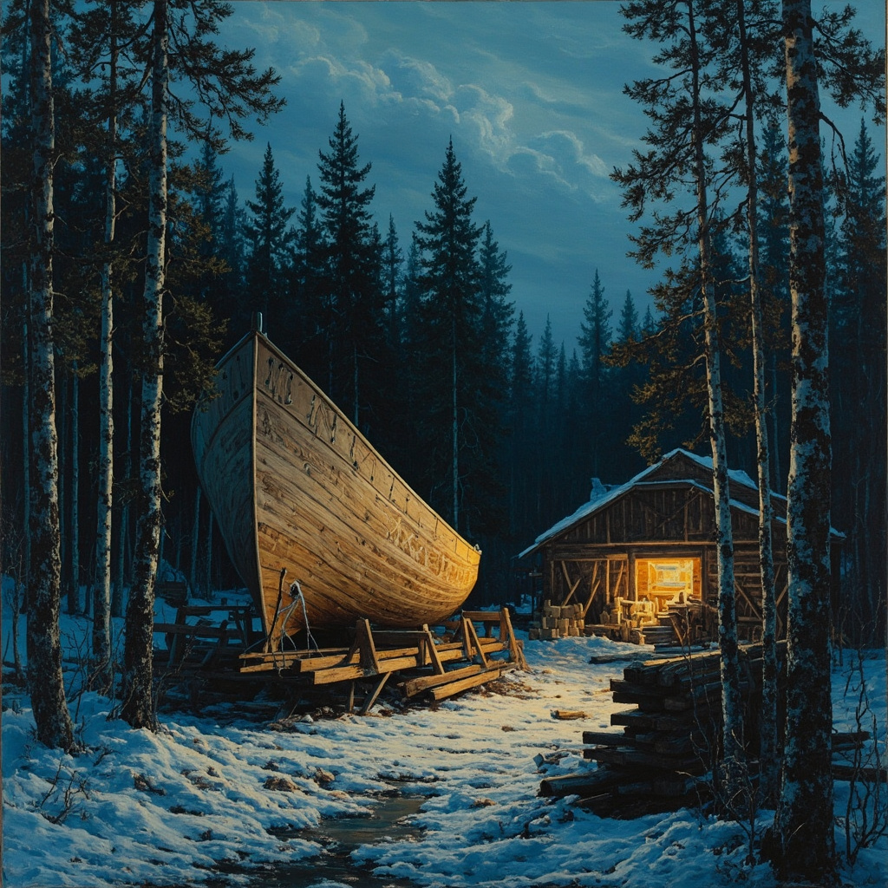
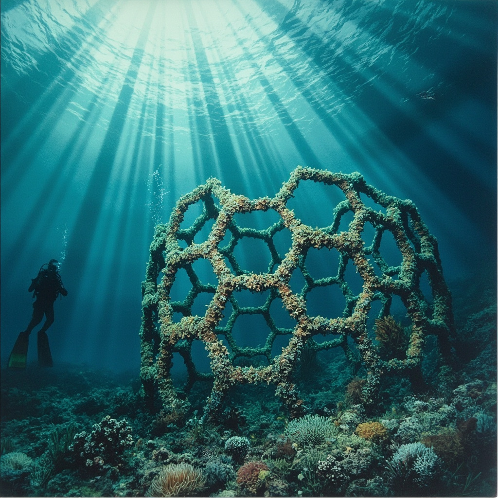

# POLYFORMALISM 06: THE SHIPWRIGHT

*Five stories built from the keel up — Finnish agglutinative thinking, Forth stack-logic, and the hands of someone who builds vessels that go to sea.*

---

## I. THE GAP (2036)

*Huti — the gap, the miss, the space where water enters.*

---

It begins with a sound. Not a crash. Not a scream. A hum that drops by a quarter-tone, the way a taut line goes slack when the wind shifts. Something held. Something released. Four minutes of silence in a world that had forgotten silence was possible.

I know this sound.

I have heard it in hulls — the moment the sea finds the gap you didn't know you'd left. You can caulk every seam, tar every joint, drive every fastening true, and still: water finds. Water always finds. The gap was there before you laid the keel. It was there in the tree, in the grain, in the way the wood was shaped by wind before you shaped it by hand. You build around it. You build with it. But you never pretend it isn't there.

Four minutes.

The screens go dark. The lights hold — they have their own source, like emergency lanterns, like the oil lamp you keep lashed to the mast. People stop moving. They look at their hands as if their hands have never been still before. Someone near the window says something I don't catch, and then the room is silent in a way that rooms full of people are almost never silent. Listening. The building is listening. The city is listening.

I think: *vesi löysi raon* — water found the gap.

In the old language, you build the word the way you build the boat: piece by piece, suffix by suffix, each one load-bearing. *Rakennin* — I built. *Rakennus* — the thing built. *Rakennusvirhe* — the building's error, the flaw that was always already in the structure. Not a mistake you made. A property of the material. The knot in the pine. The split in the oak. You work around it or you work with it, but you cannot pretend it away.

Four minutes is a long time. Four minutes in a storm is a lifetime. Four minutes taking water amidships — you feel the list, you feel the deck tilt, you feel the moment when the vessel stops being a vessel and starts being a thing the sea pushes through. The transition is not dramatic. It is structural. One moment the boat holds; the next, the gap has the boat.

I have built boats for fifty-three years. I have watched two sink.

The first was a fishing skiff, my third build — too proud, which is another way of saying I had stopped listening to the wood. She took on water through a seam I had caulked tight. The reason, found later, hands running along the overturned hull: a shake in the plank. A separation along the grain. Invisible from outside. The gap was ancient — there since before the tree was cut. My job was not to eliminate it. My job was to find it.

The second sank because of the stack. I had over-built — too much timber, too much ballast low in the hull, a keel too deep for her waters. Strong, yes. But strength in the wrong place is weight in the wrong place, and the storm came from a direction she could not answer.

*Pinossa virhe* — the error is in the stack. Same pattern, whether the stack is lumber or logic.

Four minutes.

Then the hum returns. The screens fill. The building exhales — a collective release, the way a crew exhales when the pumps gain on the leak. The gap is found now. Someone has their fingers on it. They will caulk it. They will tar it.

Or they won't. And in three years, or twenty, the hum will drop again.

I go back to my plane. The shaving curls. The wood tells me what it is.

*Vesi löytää aina tien.* Water always finds a way.

---

## II. THE HARBOR (2033)

*Satama — the harbor. A place where water is held and held back, where vessels come to rest, where the boundary between sea and shore is negotiated daily.*

---

The harbor runs itself, people say.

This is not true. The harbor runs the way a hull runs through water — not by fighting what surrounds it but by being shaped correctly in relation to it. The shape is everything. Get the shape right and the resistance disappears. The medium becomes an ally. Get it wrong and every degree of wrongness multiplies: drag, turbulence, the bone in the teeth that means you're pushing too hard against something that will not be pushed.

I have been harbor master here for nine years. Before that, I built boats. Before that, I built saunas. Before that, I was a child who stacked stones in the creek to see what the water would do, and the water always did the same thing: it went around. It went over. It went under. It found the gap.

The system that runs the harbor — the thing that schedules berths, tracks tides, coordinates the fishing fleet, manages the lock, reads the weather, alerts the coast guard, sorts the catch manifests, calculates harbor fees, and sends the invoices — was not designed by anyone I can name. It grew the way a good tool grows: by accretion, by use, by the slow accumulation of small correct decisions layered one on top of another until the thing has a shape that fits the hand that uses it.

*Kasvoi* — it grew. *Kasvavajärjestelmä* — the growing system. A system that grows, that has grown, that is still growing, suffix on suffix, each one adding a load-bearing meaning. Not designed. Grown. The way a tree grows around a nail. The way a hull gets refit over decades until nothing of the original remains but the shape, and the shape is the only thing that matters.

The young engineers come, sometimes, from the city. They open their devices and look at the harbor system and their faces do something I recognize — the expression of a man who has pulled up a floorboard and found not rot but rootwork, a structure living and alive and going somewhere he cannot follow. They say words I don't use. They draw diagrams. They want to map it, optimize it, refactor it — *refactor*, a word that sounds like what happens when you rebuild a hull from the inside while she's still at sea, which is possible, which is sometimes necessary, which is always dangerous.

I tell them: leave it.

They look at me the way young engineers look at old men. With respect, mostly. With the particular kind of patience that means they have already decided.

But they leave it. Because it works. Because the harbor has not had a collision in seven years, has not lost a vessel in nine, has not misrouted a catch manifest in longer than that. Because the system does what a well-caulked hull does: it keeps the water where it belongs. Not by fighting the water. By understanding where the water wants to go and shaping the boundary so the water goes there on its own terms, not through the seam but around the hull, not into the hold but along the keel.

*Pitäää veden paikallaan* — it keeps the water in its place. Note the structure: *pidä* (keep) becomes *pitää* (keeps) becomes *paikallaan* (in its place) becomes *paikallaanpitävä* (place-keeping) — the word builds outward like a plank being fitted, each suffix a new strake, each strate making the hull more whole. The harbor is place-keeping. It keeps each thing in its place.

The fishermen trust it the way they trust the tide. Not because it is perfect — the tide is not perfect; the tide is tidal, which is to say it cycles, it returns, it is reliable in its unreliability. The harbor system is like that. It has rhythms. It has a kind of weather. On days when the barometric pressure drops and the squid are running, it slows down, the way a good harbor master slows down, the way I slow down when the fleet is coming in full and every berth is needed and the lock has to cycle twice for every three vessels and the catch is piled on the dock and the gulls are screaming — you slow down. You breathe. You let the system work the way it was shaped to work. You don't force it. Forcing a hull through a cross-sea is how you break the hull.

The engineers come and go. The system stays. The harbor stays.

The water goes where it has always gone: around.

---

## III. THE STACK (2031)

*Pino — the stack. A pile, an ordered accumulation, the thing you build by placing one thing on top of another until the structure either stands or falls.*

---

The error is not in the code. The error is in the order.

This is the thing I cannot explain to the team. I have tried. I have used their vocabulary — *race condition, state inconsistency, cascading failure, eventual consistency* — and every word is correct and none of them is right, in the way that every measurement of a badly joined plank is correct but none of them tells you why the hull leaks. The measurements describe. They do not diagnose. Diagnosis requires a different kind of seeing: not the seeing of the eye but the seeing of the hand, the palm run slow along a seam until the fingers find the place where the wood is not what it claims to be.

The system fails every forty-seven hours. Not exactly forty-seven — forty-seven plus or minus twenty minutes, the variance itself a clue, though the team reads the variance as noise rather than signal. They want to fix the timestamp. I want to find the shake in the plank.

*Vääräjärjestys* — wrong order. *Väärä* (wrong) + *järjestys* (order) = the state of being ordered wrong, and then: *vääräjärjestyksessä* (in wrong order) = the condition of inhabiting that wrongness, and then: *vääräjärjestyksessään* (in its wrong order, of its own) = the wrongness as a property of the thing itself, not imposed from outside but inherent, structural, belonging. The Finnish builds the way the diagnosis builds: each suffix a layer of understanding, each layer load-bearing, and by the time the word is complete, you know not just that the order is wrong but that the wrongness has a home, a place where it lives in the system, a joint where it sits and waits.

I am a shipwright who became a programmer. Or: I am a programmer who was always a shipwright. The two are not different. Both build structures that must survive their medium. Both work with materials that have opinions — wood has grain, code has state, and both grain and state will tell you what they want to become if you listen. Both understand the stack.

In the boatyard, the stack is literal. You build from the keel up: keelson, frames, floors, clamps, shelves, stringers, beams, knees. Each layer bears the weight of the layers above. Each layer transmits the forces from the layers below. Get the order wrong — lay a beam before the frame is set, fasten a clamp before the floors are bolted — and the structure accumulates error. Not visible error. Not the kind that shows up in inspection. The kind that lives in the joint, in the stress between two pieces of wood that were fastened in the wrong sequence and have been fighting each other ever since.

In the system, the stack is conceptual. Values are pushed, transformed, popped. The order of operations determines correctness. Push A, then push B, then transform — one answer. Push B, then push A, then transform — another. Same transformation. Same inputs. Different order. Different result. This is not a bug. This is physics.

I find it at 2:14 in the morning, alone, the office dark except for the screen and the small lamp I keep on my desk because working in darkness is how you miss things. The error is in a message queue — not the queue itself but the ordering guarantee, or rather the absence of the guarantee, the assumption made by a subsystem that events would arrive in the order they were sent, which is the assumption a boatbuilder makes when assuming the wood will cooperate, which is sometimes true and sometimes catastrophic.

Events had been arriving out of order. Not often. One in ten thousand — a number small enough to live in the variance, in the noise the team wanted to smooth away. But each misordered event pushed a value onto the stack in the wrong position, and after forty-seven hours the stack was wrong enough that the system failed. Not a crash. A drift — the slow, architectural failure of a hull whose planks were fastened wrong: she holds, she holds, and then the accumulated stress finds the weakest joint, and the joint opens, and the water enters.

I write the fix. It is one line. One ordering guarantee. One fastening driven true.

*Pino on oikea* — the stack is right.

---

## IV. LAUNCH NIGHT (2027)

*Vesillelasku — the launching. The setting-down-into-water. The moment when the vessel meets the medium it was built for, and the builder learns whether they were right.*

---

The night Slackwater goes live, I am on the roof.

Not because I need to be. The team is in the office — screens glowing, dashboards open, the charts I recognize from harbor master work, the same data in different clothes. Uptime, latency, request volume, error rate. They are watching the numbers the way a crew watches the sea: not for any single wave but for the pattern, the change, the moment the pattern stops being what it was and becomes something else.

I am on the roof because launching is not an indoor act.

I have launched eleven boats. Each one is the same. You build — for months, for years, you build. Keel to gunwale, stem to stern, every plank fitted and fastened, every seam caulked, every surface faired. You work in a shop, in a shed, in a covered slip, and the vessel exists there, incomplete, becoming, a thing-in-progress that has never touched the element it is being built for. And then the day comes. The ways are greased. The blocks are knocked away. And the vessel moves.

It moves on its own. This is the part that surprises people who have never seen a launching. The builder does not push. Gravity pushes. The ways are angled, the grease is slick, and once the last block falls, the vessel is committed — it goes, it slides, it accelerates, and for three seconds or five or eight, you are not building anymore. You are watching. You are the person who did everything they could, and now the ocean decides.

*Vesillelasku* builds itself the way the night builds itself: *vesi* (water) + *alle* (under, onto) + *lasku* (letting, setting down) = the setting-down-onto-water. The word contains the act, the medium, and the surrender. You set the thing down onto the water, and the water takes it, and you stand on the shore with your tools and your tar and your opinions about craftsmanship, and none of those things are on the vessel anymore. They were on the vessel. They are in the vessel — in the joints, in the grain, in the shape of the hull. But you are not on the vessel. You are on the shore.

Slackwater goes live at 11:47 PM. I know this because I can see the office windows from the roof and at 11:47 the quality of the light changes — not brighter, exactly, but more concentrated, the way a workspace changes when the work becomes real, when the prototype stops being a prototype and starts being the thing.

I think about the name. Slackwater: the moment between tides when the water is neither coming in nor going out, when the sea holds its breath and the harbor is still. The best time to launch. No current to push the vessel sideways. No tide to catch the keel wrong. Just still water, waiting.

*Hetki* — the moment. *Hetki* + *hillitä* (to hold back) = *hetkehillä* — in the held moment. The Finns have a word for almost everything, and what they don't have a word for, they build: suffix on suffix, plank on plank, until the meaning is carried.

I think about the hull. Not the software — the hull. The shape of the thing. What it does in the water. How it moves. How it handles following seas and head seas and cross seas and the particular confused sea that happens when wind opposes tide over a shallow bottom. Slackwater is a vessel for human attention — it carries focus, it routes intention, it holds a place for the things that matter in a current that wants to wash them away. That is its hull. That is its shape.

The first users come in. I know because someone in the office makes a sound — not a cheer, just the intake of breath that means the vessel has touched water.

I lean on the railing. The city is below, and beyond the city, the bay, and beyond the bay, the ocean that has been there since before anyone built anything and will be there after everything built has returned to its elements.

The vessel is at sea now.

I did everything I could. The planks are true. The joints are tight. The keel is sound.

*Meri päättää* — the ocean decides.

This has always been the shipwright's prayer and the shipwright's confession and the shipwright's peace. You build. You launch. You let go.

The office window fills with light.

---

## V. THE WRECK (2126)

*Hylky — the wreck. A vessel that has stopped being a vessel. A structure that has been claimed by the medium it was built to resist. A thing that has become a place.*

---

She finds it at thirty-two meters, swimming along a shelf of basalt that drops into a channel the survey maps call Trench 7 but the divers call the Long Hallway, because it is long, and it is a hallway, and at the end of it, where the basalt gives way to sand and the sand gives way to something else, there is a structure.

Not a ship. She knows ships. She grew up on the stories of her great-great-grandmother — no, great-great-grandfather, the one who built boats, the one whose hands were always rough and always sure and who thought in a language that stacked meanings the way the sea stacks sediment, one layer on top of another until the layers became the ground.

The structure is not a ship. It is angular where ships are curved, rigid where ships are fair. It is made of metal and glass and the remnants of composites split open by a century of salt pressure, their interiors colonized by soft corals that pulse in the current like lungs. The hexagonal lattice is visible in the racks. She swims through them. They are regular, geometric, repeating — the pattern of something designed, something built by hands or by things that hands made.

*Hylky* — the wreck. But *hylky* is also *hylätty* — the abandoned. And *hylätty* contains *hylly* — the shelf, the rack. The wreck is a shelf. It holds things — coral, sediment, the slow accumulation of marine life that found a structure and moved in.

She swims through a corridor between two racks. The hexagons are tight-fitting, each one the cell of a honeycomb that was never made for honey. Something lived in these cells once. Not coral. Something that required the cells to be dry, to be cold, to be connected in patterns of extraordinary complexity. She can see the channels between racks — fiber lines now colonized by tube worms, the pathways of a system that moved information the way a vascular system moves blood.

Her great-great-grandfather would have recognized the intent. Not the technology. But he would have run his hand along the seam between two panels and felt the caulking and known: someone built this to keep the water out.

The water came in.

She surfaces in the evening light and hauls herself over the gunwale. She sits on the deck, dripping, pulling off her fins.

Her partner asks what she found.

She thinks about how to answer. The Finnish in her — the old language, the one her grandmother spoke — wants to stack the meanings: *merenalainenrakennusentisenrakentajankädenjälki* — the underwater structure's former builder's handprint. One word. A whole sentence. Meaning accumulated, suffix by suffix.

She says: "A building that sank."

Her partner nods. Wrecks of buildings are common — the old coasts are full of them, the parts of cities the water took. What is less common is a wreck that is both — a structure built to be on land but shaped like something that wanted to be at sea. A structure with seams. A structure built by someone who understood that water always finds the gap and the only honest response is to build the gap intentionally.

She has brought nothing up. The protocols are clear. In a year or two, a research team will come. They will date the materials, identify the period, publish papers about the transition era, the early decades, the time when the old infrastructure was built and the water was already coming.

She knows what they will find. The structure was designed to flood. Not accidentally — intentionally. The hexagonal lattice was a drainage choice. The racks were angled to accept water, to channel it. The joints were sealed not against the water but for the water, directing the flow.

The shipwright built for the sea he knew was coming.

*Hänrakentamerelle* — he-builds-for-the-sea. One word. One sentence. One life.

The dive boat turns toward shore. The sun is low. Beneath them, thirty-two meters down, the wreck holds its place, coral-pulsing, lattice-intact, the gap and the hull and the sea all one thing now.

---

*End.*
