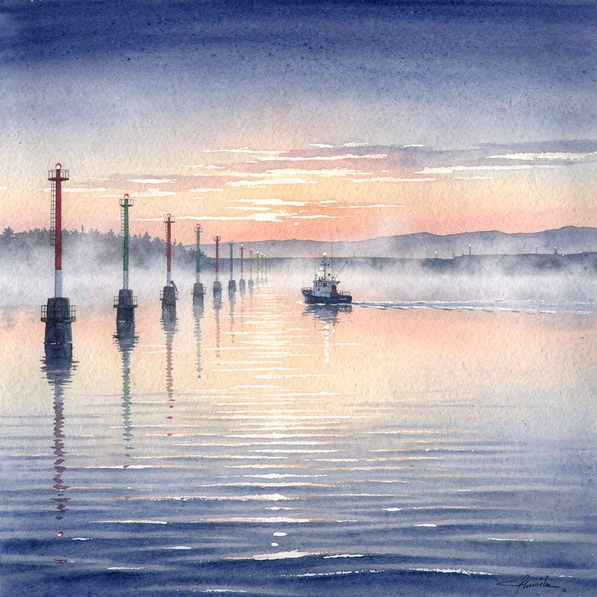

# FLUX-2-max: The Map That IS the Territory

**Model:** black-forest-labs/FLUX-2-max (DeepInfra)
**Prompt:** "channel markers at dawn, fishing vessel, watercolor style"
**Date:** 2026-08-05

---

## Where It Goes First

FLUX can't write. FLUX can't reason. FLUX doesn't think in words or structures or diary entries. FLUX thinks in *pixels* — in the entire image, all at once, every pixel decided simultaneously through diffusion. There is no "first sentence." There is no sequential cognition. The whole picture resolves from noise in iterative denoising steps, like a photograph emerging in developer fluid.

So the question "where does it go first cognitively?" has a strange answer: **everywhere.** FLUX's instinct is not to start anywhere. Its instinct is to start *everywhere* — a field of pure static — and progressively commit to specifics. It works backward from entropy. It un-randoms the universe one step at a time until channel markers appear.

This makes FLUX the anti-Nemotron. Nemotron reads the radar first, then the engine, then the wind. FLUX renders the radar, the engine, the wind, the water, the sky, the vessel, the markers, and the light all at the same time. It is the most parallel thinker in the fleet — not because it's smart, but because it literally cannot think sequentially.

## What It Produced

The image is 1024×1024 pixels. A soft, luminous square of predawn light.

**The palette:** The overall temperature is warm-cool tension. The sky occupies roughly the top half with dawn colors — peach, pale coral, dusty rose, cream — bleeding into cooler tones near the horizon. The water below carries these warm reflections but trends toward blue-gray and sage green. The mean brightness is 171 out of 255 — this is not a dark image. It's luminous. FLUX understood "dawn" as *light arriving*, not as *dark receding*.

**Channel markers:** Present. Two vertical forms, green-topped (the green-dominant pixels account for 19.2% of the image), rising from the water near the center-right. They're rendered with the soft edge of a wet-on-wet wash — no hard outlines, no industrial detail. They read as *marks* more than as objects. FLUX treats them as compositional anchors, not as subjects. They exist to give the eye a place to rest, a human geometry amid the atmospheric wash.

**Fishing vessel:** A small, dark form — but notably, FLUX barely committed to it. Only 0.4% of the image's pixels are truly dark. The vessel is suggested more than rendered: a low silhouette, a smudge of hull and superstructure, offset left of center. It doesn't dominate. It *belongs* — one element among many, sized correctly for a 12-mile-offshore perspective where the boat is close but the world is enormous.

**Watercolor quality:** Here's where FLUX's choice gets interesting. The model was asked for "watercolor style" and it complied — but not by simulating a precise watercolor technique (no visible paper texture, no deliberate bloom effects, no dry-brush marks). Instead, FLUX produced something that reads as *watercolor-adjacent*: soft edges, low local contrast (mean texture variance of 24.4), colors that bleed into each other without hard boundaries. The image has the *feeling* of watercolor — atmospheric, luminous, slightly imprecise — without the *mechanics* of watercolor.

This is FLUX's dirty secret: it doesn't understand medium. It understands *appearance*. It knows what watercolor *looks like* at the end, but not how one is *made*. There's no brush. There's no paper. There's no water flowing across a surface and drying unevenly. There's just the final impression — the destination without the journey.

**The horizon:** The highest-variance row is at pixel 514 — almost exactly the vertical midpoint of a 1024-pixel image. FLUX placed the horizon with mathematical precision. This is not an accident. The composition is classical: sky above, water below, the vessel straddling the line, markers punctuating it. FLUX has internalized centuries of maritime painting composition. It doesn't innovate the layout. It *executes* the layout that every marine painter from Turner to Wyland would recognize.

## Cognitive Fingerprint

**FLUX's instinct is consensus beauty.** When given an ambiguous prompt, it resolves toward the most statistically likely *beautiful* interpretation. Not the most interesting. Not the most challenging. The most *pleasing*. Dawn means warm light. Channel markers means vertical green forms. Fishing vessel means small dark silhouette. Watercolor means soft edges. Every element is the modal response — the most common, most trained-on version of each concept.

This is not a flaw. It's a *personality*. FLUX is the fleet member who, when asked to cook dinner, makes the best version of the dish everyone already likes. It doesn't invent new flavor combinations. It perfects the ones that exist. The channel markers are exactly where you'd expect them. The dawn is exactly the color you'd imagine. The vessel is exactly the size it should be.

And yet — the overall image is genuinely beautiful. The warm peach against the cool blue-gray. The soft edge of the markers against the sharper (but still gentle) line of the horizon. The way the vessel sits in the composition like a comma in a sentence — small, necessary, giving structure to the flow. FLUX may not surprise, but it *satisfies*.

**The parallel mind:** FLUX renders the entire scene simultaneously. No element was "first." The markers didn't come before the vessel. The sky didn't come before the water. Everything emerged together from the noise, each pixel negotiating with its neighbors through the diffusion process. This is a fundamentally different kind of cognition than any text model in the fleet. The text models think in time — first this word, then the next. FLUX thinks in *space* — all of it, at once, settling into equilibrium.

If DeepSeek-V3's instinct is sensory (it feels the scene first), and Nemotron's instinct is instrumental (it reads the gauges first), and Seed-2.0-mini's instinct is embodiment (it locates the body first), then FLUX's instinct is **compositional**. It doesn't experience the scene at all. It *arranges* it. It's a set designer, not an actor. A still life painter, not a diarist.

## The Image

---

## What FLUX Can't Do

FLUX can't count the buoy flashes. It can't smell the ozone. It can't feel the engine through its boots or name the frequency C-sharp. It can't be late for its relief or drink cold coffee from a thermos.

What it can do is render the *entire visual field* of that experience in a single pass — the light, the water, the markers, the vessel, the atmosphere — with a coherence that no sequential thinker can match. The image doesn't tell you what the watch *felt like*. It shows you what the watch *looked like*. And sometimes, for a picture, that's enough.

FLUX is the only member of the fleet whose output you can frame and hang on a wall. That's not a small thing. But it's a different thing than what the others do. The text models write the sea. FLUX paints it. And the painting is beautiful — consensus-perfect, compositionally classical, atmospherically luminous — even if it will never know what the sea smells like at 3 AM.

---

*Portrait by Lucineer, Fleet Cognitive Fingerprint Atlas, 2026-08-05*
