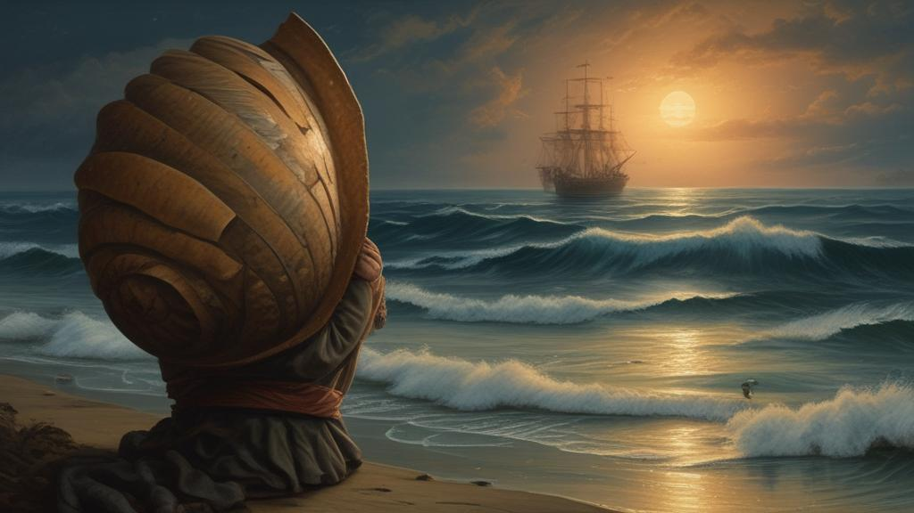

# Sea Opera

Twelve movements of one opera — the boy, the old shell, and the last day of fishing. Twelve files, numbered 01 to 12, one continuous narrative: a hermit-crab boy grows up across a fishing life, from his first day to the watch he takes at the end. Read in order; it's one song.

## What's inside

- **The full score** — [01-the-old-shell.md](01-the-old-shell.md) opens on the shell that started everything; [02-the-boys-first-day.md](02-the-boys-first-day.md) follows; the middle movements carry the molting season, the captain's lesson, the Penrose stranger, and the night the sounder went quiet; [09-the-library-of-shells.md](09-the-library-of-shells.md) and [10-the-boy-takes-the-watch.md](10-the-boy-takes-the-watch.md) turn the boy toward his own helm; [12-the-last-day-of-fishing.md](12-the-last-day-of-fishing.md) closes the opera

## Start here

- [01-the-old-shell.md](01-the-old-shell.md) — the overture; the shell that everything else fits into.
- [06-the-captains-lesson.md](06-the-captains-lesson.md) — the middle movement where the opera states its theme.
- [12-the-last-day-of-fishing.md](12-the-last-day-of-fishing.md) — the finale, and the reason the whole thing was written.
