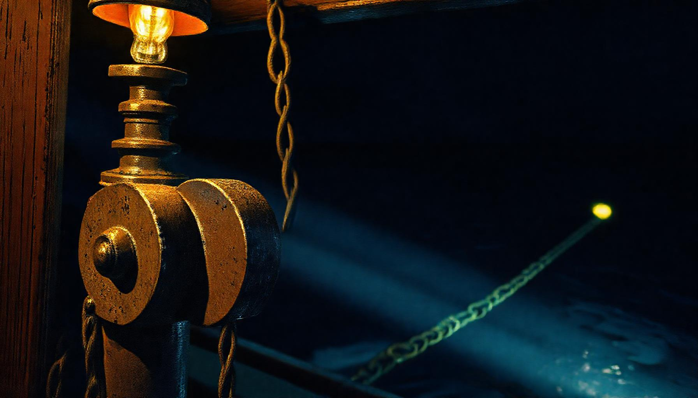

# THE RATCHET AND THE FLOOR

### A three-yard metaphor iteration + competition — 2026-08-27

*Commissioned by Casey. Three coding yards — Claude Code (Sonnet 5), KimiCode (K3), and GLM-5.3 via OpenCode — were asked to find ONE metaphor holding the shape of one day's work: an eleven-experiment collaboration wheel, a cut-glass computation story, and a four-round audit duel. Then to converge. Then to compete.*

**The convergence: THE RATCHET AGAINST A FLOOR** — motion that only goes one way, pawled against something that doesn't move. The forge supplies the heat (failure tempers), the chisel supplies the order (weakest first, best hand closes), the loft supplies the ground (fair to the floor, never to your own last line). Three dialects of one law: irreversible change, measured by external ground, never by self.

**The competition's fourth laws:**
- 🥇 **RULES OF THE PAWL SHOP** (GLM-5.3 via OpenCode) — unanimous, 3/3 rival votes: *KEEP THE RELEASE, AND PRICE IT DEAR*
- 🥈 **SHIP'S LOG — THE TOOTH** (kimi) — *commitment is quantized; the click is the proof*
- 🥉 **WHAT YOU OWE THE FLOOR** (claude) — *the debt law*

## Files
1. [The Weave](00-the-weave.md) — the full arc, round by round
2. [Round One](01-round-one-three-shapes.md) — FORGING / THE CHISEL / THE LOFT FLOOR
3. [Round Two](02-round-two-convergence.md) — convergence + the negative space, first person, the local fleet
4. [Round Three](03-round-three-the-pieces.md) — the three pieces, verbatim
5. [The Judgment](04-the-judgment.md) — rival judges' verdicts verbatim + tally

*The failure was the fertilizer. The law that wins is the law the rivals wish they'd written.*
