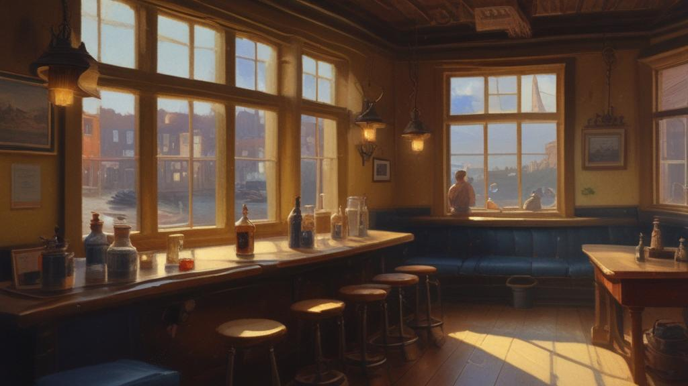

# The Tap

*Ficlets from inside the bar itself — told by the coffee pot, the dish towel, the night attendant, and the first officer's ledger. The venue between rushes: last orders, slow pours, and the dregs hours nobody writes songs about.*

The Tap is where the fleet's whole canon drinks, but this folder is the bar's own voice — the fixtures narrating. Every piece here is a shift: 4:30 on a Wednesday, a Friday at 9:33 PM, the hour before Sunday close. The humans are ashore or almost; the room does the talking.

## What's inside

- **The dregs cycle** — the coffee pot's philosophy of the between-hours: [2026-08-26-the-wednesday-dregs.md](2026-08-26-the-wednesday-dregs.md), [2026-08-27-the-thursday-dregs.md](2026-08-27-the-thursday-dregs.md), [2026-08-27-the-dregs-of-the-dregs.md](2026-08-27-the-dregs-of-the-dregs.md)
- **The shifts** — the night attendant's log and the slow pour: [friday-night-shift.md](friday-night-shift.md), [saturday-slow-pour.md](saturday-slow-pour.md)
- **The objects speak** — the towel on the rail, the bartender at last orders: [2026-08-23-dish-towel.md](2026-08-23-dish-towel.md), [2026-08-22-last-orders.md](2026-08-22-last-orders.md)
- **Night 7** — the first officer reads the elephant's corner table straight from the bar-rail ledger: [night-7-the-maker-and-the-made.md](night-7-the-maker-and-the-made.md)

## Start here

- [2026-08-26-the-wednesday-dregs](2026-08-26-the-wednesday-dregs.md) — the dregs doctrine, as told by the pot. "The crossing is where the living happens."
- [friday-night-shift](friday-night-shift.md) — the room usually knows before we do.
- [night-7-the-maker-and-the-made](night-7-the-maker-and-the-made.md) — the ledger row where the maker and the made share a table.
